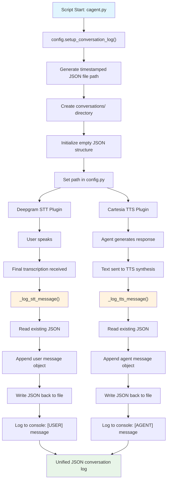

# Unified JSON Conversation Logging: Implementation Documentation

This document explains the complete implementation of JSON-based conversation logging for both user (STT) and agent (TTS) messages in your LiveKit assistant project. It includes code changes, logic flow, and implementation details.

---

## Overview

- **Goal:** Store all user (STT) and agent (TTS) messages in a single JSON file per session with timestamps and metadata.
- **Approach:** Generate a unique JSON log file path at script start, share it via a config module, and append structured messages to it.
- **Format:** JSON structure with role identification, timestamps, and source tracking.

---

## Logic Flow

1. **Script Start (`cagent.py`)**
    - Initialize conversation logging system
    - Generate a unique JSON log file path using current date and time
    - Set this path in shared config module (`config.py`)
    - Create initial JSON structure in the file

2. **STT Plugin (Deepgram)**
    - Import `config.py` for shared log path access
    - When final transcription is received, log user message
    - Append JSON object with role "user", content, timestamp, and source info
    - Display formatted message in console

3. **TTS Plugin (Cartesia)**
    - Import `config.py` for shared log path access
    - When text is being synthesized, log agent message
    - Append JSON object with role "agent", content, timestamp, and source info
    - Display formatted message in console

4. **Result**
    - All messages for a session stored in single JSON file with complete metadata
    - Real-time console logging with role indicators
    - Persistent conversation history with timestamps

---

## Flow Diagram



---

## Implementation Details

### File Structure
```
Friday-Copy/
├── config.py                    # Centralized log path management
├── cagent.py                    # Main agent with logging setup
├── conversations/               # Auto-created log directory
│   └── conversation_YYYYMMDD_HHMMSS.json
└── venv/Lib/site-packages/livekit/plugins/
    ├── cartesia/tts.py          # Modified with TTS logging
    └── deepgram/stt.py          # Modified with STT logging
```

### JSON Structure
```json
{
  "conversation": [
    {
      "role": "user",
      "content": "Hello, how are you?",
      "timestamp": "2025-08-18T14:30:22.123456",
      "source": "deepgram_stt"
    },
    {
      "role": "agent",
      "content": "नमस्ते! मैं ठीक हूँ, धन्यवाद।",
      "timestamp": "2025-08-18T14:30:23.456789",
      "source": "cartesia_tts"
    }
  ]
}
```

---

## Code Implementation

### 1. `config.py`
**Purpose:** Centralized management of conversation log file path with JSON initialization.

```python
import os
import datetime

_conversation_log_path = None

def set_conversation_log_path(path: str):
    global _conversation_log_path
    _conversation_log_path = path

def get_conversation_log_path() -> str:
    if _conversation_log_path is None:
        raise RuntimeError("Conversation log path not set!")
    return _conversation_log_path

def setup_conversation_log():
    """Setup conversation log file path and create directory if needed"""
    log_dir = os.path.join(os.getcwd(), "conversations")
    os.makedirs(log_dir, exist_ok=True)
    timestamp = datetime.datetime.now().strftime("%Y%m%d_%H%M%S")
    log_path = os.path.join(log_dir, f"conversation_{timestamp}.json")
    set_conversation_log_path(log_path)
    
    # Initialize empty conversation file
    import json
    with open(log_path, "w", encoding="utf-8") as f:
        json.dump({"conversation": []}, f, ensure_ascii=False, indent=2)
    
    return log_path
```

---

### 2. `cagent.py`
**Purpose:** Initialize conversation logging system at script start.

```python
import config

async def entrypoint(ctx: JobContext):
    # Setup conversation logging
    config.setup_conversation_log()
    
    # Rest of agent setup...
```

**Key Changes:**
- Added `import config`
- Called `config.setup_conversation_log()` at start
- Removed all manual logging code
- Removed egress recording functionality
- Simplified agent class to basic functionality

---

### 3. `tts.py` (Cartesia TTS Plugin)
**Purpose:** Log agent messages with JSON structure and console output.

```python
# Added imports
from datetime import datetime

def _log_tts_message(text: str) -> None:
    """Log TTS message to both console and JSON file"""
    try:
        # Import here to avoid circular imports
        import sys
        sys.path.append(os.path.dirname(os.path.dirname(os.path.dirname(os.path.dirname(os.path.dirname(__file__))))))
        import config
        
        # Log to console
        logger.info(f"[AGENT] {text}")
        
        # Log to JSON file
        log_file = config.get_conversation_log_path()
        
        # Read existing data
        with open(log_file, "r", encoding="utf-8") as f:
            data = json.load(f)
        
        # Append new message
        message = {
            "role": "agent",
            "content": text,
            "timestamp": datetime.now().isoformat(),
            "source": "cartesia_tts"
        }
        data["conversation"].append(message)
        
        # Write back to file
        with open(log_file, "w", encoding="utf-8") as f:
            json.dump(data, f, ensure_ascii=False, indent=2)
            
    except Exception as e:
        logger.debug(f"Failed to log TTS message: {e}")
        # Still log to console even if file logging fails
        logger.info(f"[AGENT] {text}")

# Integration points:
class ChunkedStream(tts.ChunkedStream):
    async def _run(self, output_emitter: tts.AudioEmitter) -> None:
        # ... existing code ...
        # Log the TTS input
        _log_tts_message(self._input_text)
        # ... rest of method ...

class SynthesizeStream(tts.SynthesizeStream):
    async def _sentence_stream_task(ws: aiohttp.ClientWebSocketResponse) -> None:
        # ... existing code ...
        async for ev in sent_tokenizer_stream:
            # ... existing code ...
            # Log the TTS token
            _log_tts_message(ev.token)
            # ... rest of loop ...
```

---

### 4. `stt.py` (Deepgram STT Plugin)
**Purpose:** Log user messages with JSON structure and console output.

```python
# Added imports
from datetime import datetime

def _log_stt_message(text: str) -> None:
    """Log STT message to both console and JSON file"""
    try:
        # Import here to avoid circular imports
        import sys
        sys.path.append(os.path.dirname(os.path.dirname(os.path.dirname(os.path.dirname(os.path.dirname(__file__))))))
        import config
        
        # Log to console
        logger.info(f"[USER] {text}")
        
        # Log to JSON file
        log_file = config.get_conversation_log_path()
        
        # Read existing data
        with open(log_file, "r", encoding="utf-8") as f:
            data = json.load(f)
        
        # Append new message
        message = {
            "role": "user",
            "content": text,
            "timestamp": datetime.now().isoformat(),
            "source": "deepgram_stt"
        }
        data["conversation"].append(message)
        
        # Write back to file
        with open(log_file, "w", encoding="utf-8") as f:
            json.dump(data, f, ensure_ascii=False, indent=2)
            
    except Exception as e:
        logger.debug(f"Failed to log STT message: {e}")
        # Still log to console even if file logging fails
        logger.info(f"[USER] {text}")

# Integration point:
class SpeechStream(stt.SpeechStream):
    def _process_stream_event(self, data: dict) -> None:
        # ... existing code ...
        if is_final_transcript:
            # Log final transcriptions
            if alts[0].text.strip():
                _log_stt_message(alts[0].text)
            # ... rest of method ...
```

---

## Features

### ✅ **Implemented Features:**
- **JSON-based logging** with structured data
- **Real-time file updates** after each message
- **Console logging** with role indicators `[USER]` and `[AGENT]`
- **Timestamp tracking** for all interactions
- **Source identification** (deepgram_stt, cartesia_tts)
- **Automatic directory creation** (`conversations/`)
- **Unique session files** with timestamp naming
- **Error handling** with graceful fallbacks
- **Plugin-level integration** (no agent-level dependencies)

### 📊 **Console Output Example:**
```
2025-08-18 14:30:22,123 - INFO livekit.plugins.deepgram - [USER] नमस्कार, आप कैसे हैं?
2025-08-18 14:30:23,456 - INFO livekit.plugins.cartesia - [AGENT] नमस्ते! मैं ठीक हूँ, धन्यवाद। आपका दिन कैसा जा रहा है?
```

### 📁 **File Output Example:**
```json
{
  "conversation": [
    {
      "role": "user",
      "content": "नमस्कार, आप कैसे हैं?",
      "timestamp": "2025-08-18T14:30:22.123456",
      "source": "deepgram_stt"
    },
    {
      "role": "agent",
      "content": "नमस्ते! मैं ठीक हूँ, धन्यवाद। आपका दिन कैसा जा रहा है?",
      "timestamp": "2025-08-18T14:30:23.456789",
      "source": "cartesia_tts"
    }
  ]
}
```

---

## Usage

### Running the Agent:
```bash
python cagent.py dev
```

### Expected Behavior:
1. **Startup**: Creates `conversations/conversation_YYYYMMDD_HHMMSS.json`
2. **User Speech**: Logs to console as `[USER] message` and JSON file
3. **Agent Response**: Logs to console as `[AGENT] message` and JSON file
4. **File Updates**: JSON file updated in real-time after each message

### File Location:
- **Directory**: `conversations/` (auto-created in project root)
- **Filename**: `conversation_20250818_143022.json` (timestamp-based)
- **Format**: UTF-8 encoded JSON with proper indentation

---

## Best Practices & Notes

### ✅ **Implementation Best Practices:**
- **Centralized configuration** via `config.py` module
- **Plugin-level integration** for automatic capture
- **Error handling** with console fallback
- **UTF-8 encoding** for multi-language support (Hindi/English)
- **JSON formatting** with proper indentation for readability
- **Timestamp precision** with ISO format including microseconds

### 🔧 **Technical Considerations:**
- **File I/O operations** are synchronous but fast for small JSON files
- **Path resolution** uses dynamic imports to avoid circular dependencies
- **Error isolation** ensures one failed log doesn't break the system
- **Real-time updates** provide immediate feedback and persistence

### 🚀 **Extension Possibilities:**
- Add conversation analytics and summaries
- Implement conversation search and filtering
- Add export functionality to different formats
- Include audio duration and quality metrics
- Add conversation tagging and categorization

---

## Troubleshooting

### Common Issues:

1. **Config module not found**
   - Ensure `import config` is present in plugin files
   - Check that `config.py` exists in the project root

2. **JSON file not created**
   - Verify write permissions in project directory
   - Check that `conversations/` directory is created
   - Ensure `config.setup_conversation_log()` is called at startup

3. **Console logging not appearing**
   - Check logging level configuration
   - Verify plugin imports are working correctly
   - Ensure logger configuration in main script

4. **JSON corruption**
   - The system uses atomic read-modify-write operations
   - If corruption occurs, delete the file and restart
   - Consider implementing file locking for high-concurrency scenarios

### Debug Commands:
```python
# Check if config is properly set
import config
print(config.get_conversation_log_path())

# Verify JSON file structure
import json
with open("conversations/conversation_XXXXXX.json", "r") as f:
    data = json.load(f)
    print(json.dumps(data, indent=2))
```

---

## Version Information

- **Implementation Date**: August 18, 2025
- **LiveKit Version**: Compatible with latest agents framework
- **Python Version**: 3.8+
- **Plugin Dependencies**: Cartesia TTS, Deepgram STT
- **File Format**: JSON with UTF-8 encoding
