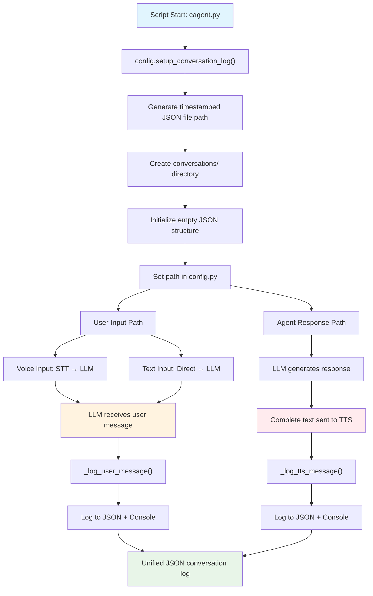

# Hybrid JSON Conversation Logging: Implementation Documentation

This document explains the hybrid implementation of JSON-based conversation logging that combines LLM-level user input capture with TTS-level agent response logging in your LiveKit assistant project.

---

## Overview

- **Goal:** Store all user and agent messages in a single JSON file per session with optimal capture points.
- **Hybrid Approach:** Capture user input at LLM level (handles both voice + text input) and agent responses at TTS level (complete, clean responses).
- **Format:** JSON structure with role identification, timestamps, and source tracking.

---

## Why Hybrid Approach?

### 🎯 **Problems Solved:**

1. **Text Input Coverage**: Direct text input to LLM wasn't captured by STT plugins
2. **Response Chunking**: LLM-level agent logging captured incomplete chunks instead of full responses
3. **Optimal Timing**: Different capture points provide better data quality for each role

### ✅ **Advantages:**

- **User Input**: LLM captures both voice (STT → LLM) and direct text input
- **Agent Response**: TTS captures complete, final responses ready for speech
- **Clean Logs**: No duplicate entries or partial chunks
- **Speech-Level Timing**: Logs reflect actual conversation flow

---

## Logic Flow



---

## Implementation Details

### File Structure
```
Friday-Copy/
├── config.py                           # Centralized log path management
├── cagent.py                          # Main agent with logging setup
├── conversations/                     # Auto-created log directory
│   └── conversation_YYYYMMDD_HHMMSS.json
└── venv/Lib/site-packages/livekit/plugins/
    ├── cartesia/tts.py               # Modified with agent response logging
    └── google/llm.py                 # Modified with user input logging
```

### JSON Structure
```json
{
  "conversation": [
    {
      "role": "user",
      "content": "Hello, how are you?",
      "timestamp": "2025-08-18T14:30:22.123456",
      "source": "google_llm"
    },
    {
      "role": "agent",
      "content": "नमस्ते! मैं ठीक हूँ, धन्यवाद।",
      "timestamp": "2025-08-18T14:30:23.456789",
      "source": "cartesia_tts"
    }
  ]
}
```

---

## Code Implementation

### 1. `config.py`
**Purpose:** Centralized management of conversation log file path with JSON initialization.

```python
import os
import datetime

_conversation_log_path = None

def set_conversation_log_path(path: str):
    global _conversation_log_path
    _conversation_log_path = path

def get_conversation_log_path() -> str:
    if _conversation_log_path is None:
        raise RuntimeError("Conversation log path not set!")
    return _conversation_log_path

def setup_conversation_log():
    """Setup conversation log file path and create directory if needed"""
    log_dir = os.path.join(os.getcwd(), "conversations")
    os.makedirs(log_dir, exist_ok=True)
    timestamp = datetime.datetime.now().strftime("%Y%m%d_%H%M%S")
    log_path = os.path.join(log_dir, f"conversation_{timestamp}.json")
    set_conversation_log_path(log_path)
    
    # Initialize empty conversation file
    import json
    with open(log_path, "w", encoding="utf-8") as f:
        json.dump({"conversation": []}, f, ensure_ascii=False, indent=2)
    
    return log_path
```

---

### 2. `cagent.py`
**Purpose:** Initialize conversation logging system at script start.

```python
import config

async def entrypoint(ctx: JobContext):
    # Setup conversation logging
    config.setup_conversation_log()
    
    # Rest of agent setup...
```

---

### 3. `llm.py` (Google LLM Plugin) - USER INPUT LOGGING
**Purpose:** Log user input messages from LLM level to capture both voice and text input.

```python
# Added imports
import sys
from datetime import datetime

def _log_user_message(content: str) -> None:
    """Log user message to both console and JSON file"""
    try:
        # Import here to avoid circular imports
        sys.path.append(os.path.dirname(os.path.dirname(os.path.dirname(os.path.dirname(os.path.dirname(__file__))))))
        import config
        
        # Log to console
        logger.info(f"[USER] {content}")
        
        # Log to JSON file
        log_file = config.get_conversation_log_path()
        
        # Read existing data
        with open(log_file, "r", encoding="utf-8") as f:
            data = json.load(f)
        
        # Append new message
        message = {
            "role": "user",
            "content": content,
            "timestamp": datetime.now().isoformat(),
            "source": "google_llm"
        }
        data["conversation"].append(message)
        
        # Write back to file
        with open(log_file, "w", encoding="utf-8") as f:
            json.dump(data, f, ensure_ascii=False, indent=2)
            
    except Exception as e:
        logger.debug(f"Failed to log user message: {e}")
        # Still log to console even if file logging fails
        logger.info(f"[USER] {content}")

# Integration point in LLMStream._run():
class LLMStream(llm.LLMStream):
    async def _run(self) -> None:
        # ... existing code ...
        turns_dict, extra_data = self._chat_ctx.to_provider_format(format="google")
        turns = [types.Content.model_validate(turn) for turn in turns_dict]
        
        # Log user input - extract last user message from turns
        for turn in reversed(turns):
            if turn.role == "user" and turn.parts:
                for part in turn.parts:
                    if part.text and part.text.strip():
                        _log_user_message(part.text.strip())
                        break
                break
        # ... rest of method ...
```

---

### 4. `tts.py` (Cartesia TTS Plugin) - AGENT RESPONSE LOGGING
**Purpose:** Log complete agent responses at TTS level for clean, final text capture.

```python
# Added imports
import sys
from datetime import datetime

def _log_tts_message(text: str) -> None:
    """Log TTS message to both console and JSON file"""
    try:
        # Import here to avoid circular imports
        sys.path.append(os.path.dirname(os.path.dirname(os.path.dirname(os.path.dirname(os.path.dirname(__file__))))))
        import config
        
        # Log to console
        logger.info(f"[AGENT] {text}")
        
        # Log to JSON file
        log_file = config.get_conversation_log_path()
        
        # Read existing data
        with open(log_file, "r", encoding="utf-8") as f:
            data = json.load(f)
        
        # Append new message
        message = {
            "role": "agent",
            "content": text,
            "timestamp": datetime.now().isoformat(),
            "source": "cartesia_tts"
        }
        data["conversation"].append(message)
        
        # Write back to file
        with open(log_file, "w", encoding="utf-8") as f:
            json.dump(data, f, ensure_ascii=False, indent=2)
            
    except Exception as e:
        logger.debug(f"Failed to log TTS message: {e}")
        # Still log to console even if file logging fails
        logger.info(f"[AGENT] {text}")

# Integration points:

# 1. ChunkedStream - For complete text synthesis
class ChunkedStream(tts.ChunkedStream):
    async def _run(self, output_emitter: tts.AudioEmitter) -> None:
        json = _to_cartesia_options(self._opts, streaming=False)
        json["transcript"] = self._input_text

        # Log the complete TTS input (final agent response)
        _log_tts_message(self._input_text)
        # ... rest of method ...

# 2. SynthesizeStream - For streaming text synthesis
class SynthesizeStream(tts.SynthesizeStream):
    def __init__(self, *, tts: TTS, conn_options: APIConnectOptions):
        # ... existing code ...
        self._logged_text = ""  # Track text for logging

    async def _run(self, output_emitter: tts.AudioEmitter) -> None:
        # ... existing code ...
        
        async def _input_task() -> None:
            async for data in self._input_ch:
                if isinstance(data, self._FlushSentinel):
                    sent_tokenizer_stream.flush()
                    continue

                sent_tokenizer_stream.push_text(data)
                # Accumulate text for logging
                self._logged_text += data

            sent_tokenizer_stream.end_input()
            
            # Log complete text when input ends
            if self._logged_text.strip():
                _log_tts_message(self._logged_text.strip())
        # ... rest of method ...
```

---

## Features

### ✅ **Implemented Features:**

#### **User Input Logging (LLM Level):**
- ✅ **Voice input capture** (STT → LLM pathway)
- ✅ **Text input capture** (Direct text → LLM pathway)
- ✅ **Single log point** for all user input types
- ✅ **Complete message capture** (no STT intermediate chunks)

#### **Agent Response Logging (TTS Level):**
- ✅ **Complete response capture** (no LLM chunks)
- ✅ **Clean final text** ready for speech synthesis
- ✅ **Both ChunkedStream and SynthesizeStream** support
- ✅ **Accumulated text logging** for streaming responses

#### **General Features:**
- ✅ **JSON-based logging** with structured data
- ✅ **Real-time file updates** after each message
- ✅ **Console logging** with role indicators `[USER]` and `[AGENT]`
- ✅ **Timestamp tracking** for all interactions
- ✅ **Source identification** (google_llm, cartesia_tts)
- ✅ **Automatic directory creation** (`conversations/`)
- ✅ **Unique session files** with timestamp naming
- ✅ **Error handling** with graceful fallbacks

---

## Console Output Examples

### Successful Logging:
```
2025-08-18 14:30:22,123 - INFO livekit.plugins.google - [USER] Hello, how are you?
2025-08-18 14:30:23,456 - INFO livekit.plugins.cartesia - [AGENT] नमस्ते! मैं ठीक हूँ, धन्यवाद। आपका दिन कैसा जा रहा है?
```

### Voice Input Example:
```
2025-08-18 14:31:15,789 - INFO livekit.plugins.google - [USER] भोपाल का temperature बताओ
2025-08-18 14:31:17,234 - INFO livekit.plugins.cartesia - [AGENT] जी बॉस, भोपाल का तापमान २९ डिग्री सेल्सियस है।
```

### Text Input Example:
```
2025-08-18 14:32:05,678 - INFO livekit.plugins.google - [USER] What's the weather like?
2025-08-18 14:32:07,891 - INFO livekit.plugins.cartesia - [AGENT] मैं आपके लिए मौसम की जानकारी प्राप्त कर रही हूँ।
```

---

## File Output Examples

### Clean Conversation Log:
```json
{
  "conversation": [
    {
      "role": "user",
      "content": "भोपाल का temperature बताओ",
      "timestamp": "2025-08-18T14:31:15.789123",
      "source": "google_llm"
    },
    {
      "role": "agent",
      "content": "जी बॉस, मैं भोपाल का तापमान अभी प्राप्त कर रही हूँ।",
      "timestamp": "2025-08-18T14:31:16.234567",
      "source": "cartesia_tts"
    },
    {
      "role": "agent",
      "content": "जी बॉस, भोपाल का तापमान २९ डिग्री सेल्सियस है।",
      "timestamp": "2025-08-18T14:31:17.891234",
      "source": "cartesia_tts"
    }
  ]
}
```

---

## Usage

### Running the Agent:
```bash
python cagent.py dev
```

### Expected Behavior:
1. **Startup**: Creates `conversations/conversation_YYYYMMDD_HHMMSS.json`
2. **User Input** (Voice or Text): Logged when LLM receives message
3. **Agent Response**: Logged when TTS begins synthesis
4. **File Updates**: JSON file updated in real-time after each message

### Input Methods Supported:
- **Voice Input**: User speaks → STT → LLM → logged
- **Text Input**: User types → LLM → logged
- **Mixed Session**: Both voice and text inputs in same conversation

---

## Comparison with Previous Approaches

### ❌ **Previous Plugin-Level Approach:**
- **STT Plugin**: Only captured voice input, missed text input
- **TTS Plugin**: Captured agent responses correctly
- **Issue**: Incomplete user input coverage

### ❌ **Previous LLM-Only Approach:**
- **User Input**: Captured both voice and text ✅
- **Agent Response**: Captured chunks instead of complete responses ❌
- **Issue**: Fragmented agent response logging

### ✅ **Current Hybrid Approach:**
- **User Input (LLM)**: Captures both voice and text ✅
- **Agent Response (TTS)**: Captures complete, clean responses ✅
- **Result**: Optimal logging for both roles ✅

---

## Technical Considerations

### 🔧 **Performance:**
- **Minimal overhead**: Single log point per message role
- **Fast I/O**: Small JSON files with atomic operations
- **Error isolation**: Failed logging doesn't break conversation

### 🔒 **Reliability:**
- **Graceful degradation**: Console logging continues if file logging fails
- **Path resolution**: Dynamic imports avoid circular dependencies
- **UTF-8 encoding**: Full Unicode support for multilingual conversations

### 🚀 **Scalability:**
- **Per-session files**: Prevents large single file issues
- **Timestamp-based naming**: Natural chronological organization
- **Extensible structure**: Easy to add metadata fields

---

## Troubleshooting

### Common Issues:

1. **User messages not logged**
   - Check LLM plugin modifications are applied
   - Verify `config` module import in `llm.py`
   - Ensure LLM is receiving user input correctly

2. **Agent messages not logged**
   - Check TTS plugin modifications are applied
   - Verify `config` module import in `tts.py`
   - Ensure TTS is receiving complete text

3. **Mixed logging sources**
   - Only `google_llm` should log user messages
   - Only `cartesia_tts` should log agent messages
   - Remove any old STT/Deepgram logging code

4. **JSON file corruption**
   - Check file permissions in project directory
   - Verify JSON structure with validator
   - Delete corrupted file and restart session

### Debug Commands:
```python
# Verify hybrid logging setup
import config
print("Log path:", config.get_conversation_log_path())

# Check recent conversation
import json
with open("conversations/conversation_XXXXXX.json", "r") as f:
    data = json.load(f)
    for msg in data["conversation"][-5:]:  # Last 5 messages
        print(f"{msg['source']}: [{msg['role'].upper()}] {msg['content']}")
```

---

## Future Enhancements

### 🎯 **Potential Improvements:**
- **Message metadata**: Add conversation context, tool usage, response times
- **Analytics integration**: Track conversation patterns and user behavior
- **Export functionality**: Convert to different formats (CSV, XML, etc.)
- **Search capabilities**: Find specific conversations or message content
- **Conversation summaries**: Automated session summaries

### 🔄 **Performance Optimizations:**
- **Batch logging**: Group multiple messages for bulk file operations
- **Async I/O**: Non-blocking file operations for high-frequency logging
- **Compression**: Automatic compression for long conversations
- **Database integration**: Optional database backend for large-scale deployments

---

## Version Information

- **Implementation Date**: August 18, 2025
- **Approach**: Hybrid LLM-TTS logging system
- **LiveKit Version**: Compatible with latest agents framework
- **Python Version**: 3.8+
- **Dependencies**: Google LLM, Cartesia TTS
- **File Format**: JSON with UTF-8 encoding
- **Logging Sources**: `google_llm` (user), `cartesia_tts` (agent)
